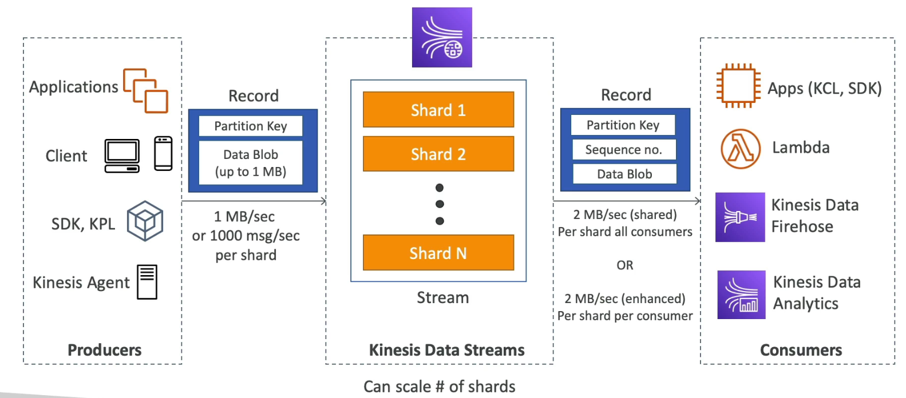
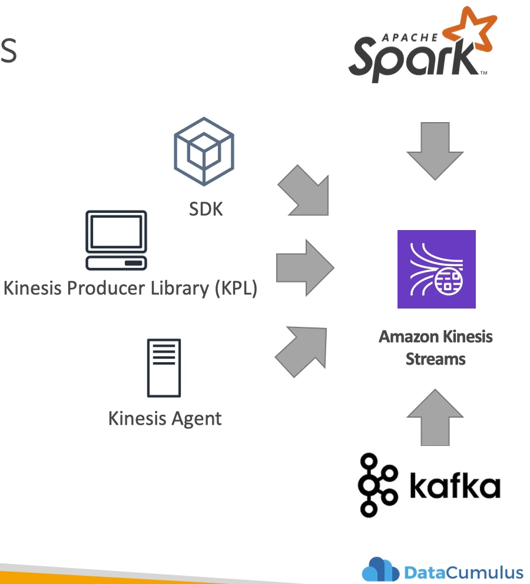
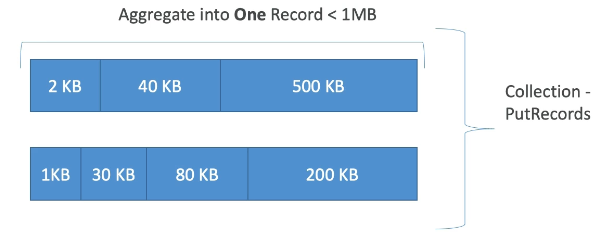
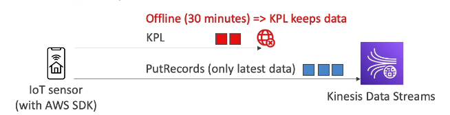
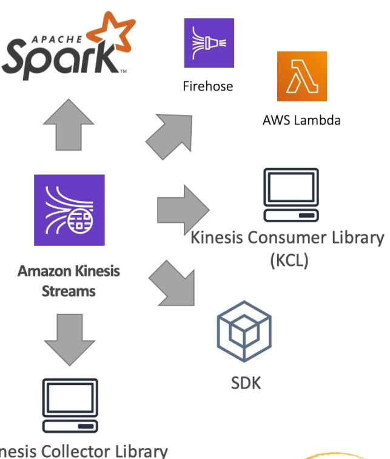
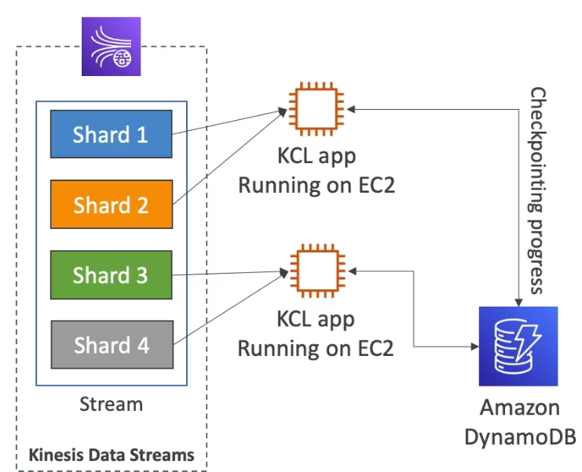
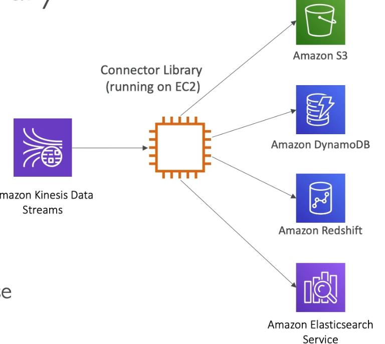
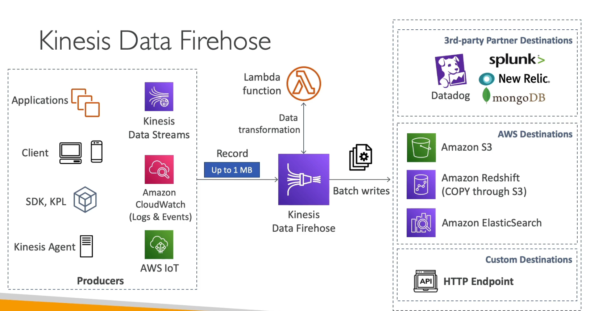
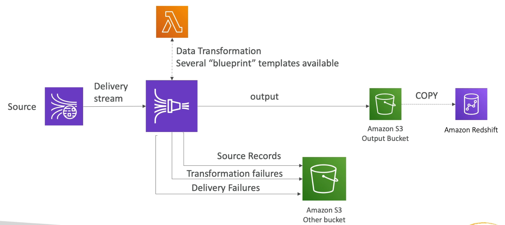
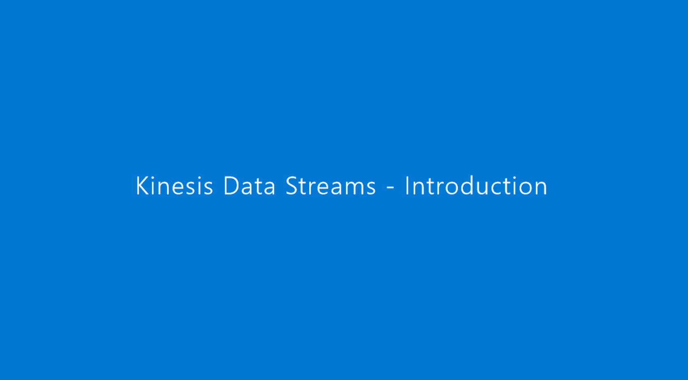

```{r, setup, include=FALSE}
library("vembedr")
knitr::opts_chunk$set(echo = TRUE, collapse=TRUE)
```

## Introduction {.tabset}

These are the notes while preparing for AWS Certified Data Analytics Specialty 2022. In this journey, we will make important concept notes for following five sections for Data Analytics

* Collection
* Storage
* Processing
* Analysis
* Visualization
* Domain & Security

--------------------------------------------------------------------------

### Collection

* Kinesis (Data Streams,Producers,Consumers,Enhanced Fan Out,Scaling,Security,Data Firehose)
* SQS
* IoT
* Database Migration Service (DMS)
* Direct Connect
* Snow Family
* MSK (Managed Streaming, Connect, Serverless)

--------------------------------------------------------------------------

### Storage
* S3 (Storage,Lifecycle Rules,Versioning,Replication,Performance,Security,Event Notifications)
* DynamoDB (Basics,APIs,Indexes,PartiQL,DAX,Streams,TTL,Patterns,Security)
* ElastiCache (Fundamental)

--------------------------------------------------------------------------

### Processing
* Lambda
* Glue, Hive, ETL (Catalog, end-points, Costs)
* Glue Studio & DataBrew
* Glue Elastic Views
* Lake Formation
* Infrastructure (EMR, Hadoop, Serverless, Apache Spark)
* Spark integration with Kinesis & Redshift
* Applications on EMR (Hive,Pig,HBase,Presto,Zeppelin,Hue,Splunk,Flume)
* Data Pipeline
* Step Functions

--------------------------------------------------------------------------

### Analysis
* Kinesis Analytics
* OpenSearch
* Athena
* Redshift

--------------------------------------------------------------------------

### Visualization
* Quicksight (Pricing,Dashboards, ML Insights)

--------------------------------------------------------------------------

### Domain & Security
* S3 Encryption
* KMS (Basics,Key Rotation)
* Cloud HSM
* STS & Cross Account
* Identity Federation
* Policies
* CloudTrail
* VPC Endpoints

--------------------------------------------------------------------------

### Other Topics
* EC2 for Big Data
* AWS AppSync and Kendra
* AWS Data Exchange
* AWS AppFlow
* AWS Cleanup
* Sagemaker

--------------------------------------------------------------------------

## Collection {.tabset}

There are multiple ways for data collection in AWS. 

* **Real Time collection** - where we can perform action on our data
  * KDS, SQS, IoT - These services help you to react in real-time to events or data that is happening in your infrastructure

  
* **Near-real-time** - Reactive Actions
  * Firehose, DMS

  
* **Batch - Historical Analysis** - when we want to move large amount of data to perform some data analysis
  * Snowball, Data Pipeline

--------------------------------------------------------------------------

### Kinesis Data Streams

<u>**Overview**</u>

```{r echo=FALSE, out.width='100%'}

```

* Way to stream big data into your systems. It is made of multiple **shards** and this is something we need to provision ahead of time
* **Shard** - Data is split across all the shards and they define stream capacity in terms of ingestion and consumption rates
* **Producers** - Send data (**Produce Records**) into KDS and can be **manyfold**. Ex. applications, clients, SDK, KPL, Kinesis Agent. Data can be sent at the rate of **1 MB/s or 1000 msg/sec per shard**
* **Records** - is made of *partition key* and *data blob (upto 1 MB)*
  * Partition key - determines in which shard will the record go to
  * Data Blob - Value itself
* **Consumers** - Applications, Lambda functions, Firehose, Kinesis Data Analytics
  * When a consumer receives a record, it receives a *partition key, sequence number (where the record was in shard), and data blob*
  * 2 MB/sec (shared) per shard all consumers
  * 2 MB/sec (enhanced) per shard per consumer

* **Properties:**
  * **Retention period** - 1 day to 1 year
  * Ability to reprocess data
  * Once data is inserted, it can't be deleted **(immutable)**
  * Data that shares same partition, goes to same shard

* **Capacity Modes:**
  * *Provisioned Mode* 
    * Choose # of shards and scale manually or through API
    * Input (1 MB/sec) & throughput (2 MB/sec both classic/enhanced)
    * Pay per shard provisioned per hour
  * *On-demand Mode*
    * No provision needed
    * Default capacity provisioned (4 MB/sec)
    * Automatic scaling (observed throughput peak during last 30 days)
    * Pay per stream per hour & data in/out per GB

* **Security:**
  * It is within region (where we have shards)
  * IAM polices for shards
  * Encryption
    * in-flight: HTTPS endpoints
    * at-rest: KMS
    * client side
  * VPC Endpoints available for Kinesis
  * Monitor API calls through CloudTrail

--------------------------------------------------------------------------

### Producers

How is the data ingested into Kinesis Streams. 

```{r echo=FALSE, out.width='50%', fig.align='center'}

```

* **SDK** - allows you to write code or use CLI to directly send data into Kinesis Streams
  * <u>*PutRecord(s) API*</u>
    * API to send one or more records
    * Uses batching and **increases** throughput (which means there will be less HTTP requests as we send many records as a part of one HTTP request)
    * Over the limits of throughput, we will get **ProvisionedThroughputExceeded**
    * SDK can be used in very different ways: Mobile SDK (Android, iOS)
    * **Used case** - in case of *low throughput*, need *higher latency* with simple API or just working directly from *Lambda*
    * **AWS Managed sources (uses SDK) for KDS** - CW logs, IoT, Kinesis Data Analytics
  * <u>*ProvisionedThroughputExceeded*</u>
    - It happens when we are sending more data than expected i.e. *exceeding MB/s or TPS for any shard*
    - Due to **hot shard** (partition key is corrupted and excess data into that partition). Need to distribute as much as possible
    - (+) Retries with backoff
    - (+) Increase shards (scaling)
    - (+) ensure partition key is good (distributed well)
* **Kinesis Producer Library (KPL)** - more advanced, write better code and has good features (for enhanced throughput)
  * Easy to use and highly configurable C++/Java library
  * Used for **building high performance, long running producers**
  * **Automated + configurable** retry mechanism (*Automatically deals with issue with API (SDK)*)
  * 2 Types of APIs:
    * Synchronous: Same as SDK
    * Asynchronous: Better performance for async process
  * **Submit** metrics to CW for monitoring
  * **Supports batching** - increased throughput + decrease cost (ON by default)
    * Collect Records + Write to multiple shards
    * Aggregate that increases latency i.e. *capability to store multiple records in one record* + *increase payload size and imporve throughput*
  * Compression (by user only) - *make records smaller*
  * To read **KPL Records**, we need KCL or special helper library (can't use CLI)
  * <u>**Batching**</u>
    * Let us say we are sending 2 KB of data to Kinesis Data streams using KPL
    * It won't be sent away on spot but **will wait for next records that might be coming** 
    * At one point, KPL can **aggregate** all records into one record and we can do it multiple times
```{r echo=FALSE, out.width='50%', fig.align='center'}

```
    * And then to make it more efficient, it will Collect all aggregated records in PutRecords in one API call 
    * We can use **RecordMaxBufferedTime** that introduces some delay waiting for all records to go together in one API call **(default is 100ms)**
    * **WHEN NOT TO USE KPL** - Applciation that can't tolerate additional delay is not good use case here (need to use SDK directly here)

```{r echo=FALSE, out.width='550%', fig.align='center'}

```
    
* **Kinesis Agent** - Linux program that runs on server to fetch log files and send reliably to Kinesis Streams
  * Java based agent and built upon KPL
  * Only Linux based system
  * Features:
    * Write from multiple directories and write to multiple streams
    * Routing feature based on directory / log file
    * Pre-process data before sending to streams
    * handles log file rotation, checkpointing and retry upon failures
    * Emits metrics to CW for monitoring
  
* **Third party libraries** - Spark, Flume, log4j, Kafka Connect, NiFi

### Consumers

How is the data consumed from Kinesis Streams

```{r, echo=FALSE, out.width='50%', fig.align='center'}

```

* **SDK** 
  * <u>*GetRecord(s) API*</u>
    * Records are polled by consumers from a shard
    * Each shard has **2 MB total aggregate throughput** i.e. 3 shards means total 6MB
    * return upto *10 MB of data with a throttle for 5 sec* or upto 10k records
    * **Latency limit - Max of 5 GetRecords() calls shard/sec** i.e. 200ms latency
    * *More consumers = less throughput*
    
```{r echo=FALSE, out.width='30%', fig.align='center'}
knitr::include_graphics('./images/consumer_sdk.png')
```

* **Kinesis Client Library (KCL)** - Similarly, we produce by KPL, here we will consume the data by KCL
  * Java-first library but exists for other languages too (Golang, Python, Ruby, Node, .Net)
  * Read records from Kinesis produced with KPL (de-aggregation)
  * **Multiple consumers** with **multiple shards** in **one** group - **Shard Discovery**
  * **Checkpointing** - feature to resume progress
  * Uses **DynamoDB for coordination and checkpointing**
    * Provision DynamoDB (WCU/RCU)
    * Or use On-demand 
    * If we get **ExpiredIteratorException**, we should increase WCU
  * Record processors will process the data
  * Example below
    * We have a Kinesis Streams with 4 shards
    * We have a DynamoDB for Checkpointing and Coordination
    * We have 2 KCL applications running on two different EC2 in same group
    * With the help of shard discovery mechanism, KCL1 will be reading from Shard 1&2 and KCL2 will be reading from Shard 3&4
    * Then KCL applications will be checkpointing with DynamoDB
    
```{r echo=FALSE, out.width='30%', fig.align='center'}

```
   
* **Kinesis Connector Library** - Older Java library in 2016 and uses KCL library in the back-end and *uses EC2 to write data to different sources.*
  * It's sole purpose is to take data from Kinesis data streams and write data to **S3, DynamoDB, Redshift, ElasticSearch**
  * This service is replaced by Firehose and Lambda together
  

```{r echo=FALSE, out.width='30%', fig.align='center'}

```
 

* **Third party libraries** - **Apache Spark, Log4j**, Appenders, Flume, Kafka Connect
* **Kinesis Firehose**
* **AWS Lambda**
  * Source records from Data streams
  * It has a library to de-aggregate record from KPL
  * Use to run lightweight ETL to **S3, DynamoDB, Redshift, ElasticSearch**
  * Read in real-time from Kineses Data Streamsn and trigger notifications (with configurable batch size)

### Enhanced Fan Out

* Works with KCL 2.0 & AWS Lambda
* Each consumer will get 2 MB/s provisioned throughput per shard i.e. the data is **pushed** with 2 MB/s when consumer is SubscribeToShard()
* **Enhanced Fan Out** - pushing data to consumers over HTTP/2
* Can cover more consumers + reduced latency (~70 ms)
* Standard Consumers vs Enhanced Fan out
  * SC - Low # of consuming applications, tolerate ~200 ms latency, low cost
  * EF - Multiple consumer applications, low latency ~70 ms and higher costs

### Scaling

* **Operations**
  * *Add Shards* - Shard splitting, inc stream capacity (1 MB/s data in per shard), divide a *hot shard*, old shard is closed and will be deleted once the data is expired, *helps to improve throughput*
  * *Merge Shards* - dec stream capacity + save cost, group 2 shards with low traffic, old shards are closed and deleted based on data expiration
  * *Out-of-order records* :
    * Reason is Resharding
    * Read from child shards
    * Data that hasn't be read is still be parent
    * After resharding, read entirely from parent until we don't have new records
    * KCL already has logic built-in even after resharding
  * *AutoScaling*: not native Kinesis feature, API call to change UpdateShardCount, implement AutoScaling with Lambda

* **Limitations**
  * Resharding can't be done in parallel (plan capacity in advance)
  * Perform one resharding operation at a time
  * For 1k shards it take 30K seconds (~8 hrs) to double shards to 2000  
  * *Can't* scale
    * more than 10x for each  rolling 24h period for each stream
    * up to more then double your current shard count
    * down below 1/2 of your current shard count
    * up to more than 500 shards in a stream
    * stream upto 500 shards down
    * up more than shard limit for your account

### Handling Duplicate Records

* **Producers:**
  * Due to network timeouts, duplicates are created as acknowledgement may not be received to producers
  * embed unique record it id in data to deduplicate
* **Consumers:**
  * Retries can make application read data twice
  * Retries happen when:
    * worker terminates unexpectedly
    * worker instances are added/removed
    * shards are merged or split
    * application is deployed
  * Fixes:
    * make consumer applciation idempotent
    * if final destination can handle duplicates, it is recommended to do it there

### Security

* Control access/authorization using IAM
* Encryption in flight using HTTPS
* Encryption at rest using KMS
* Client side encryption
* VPC Endpoints available for Kinesis to access within VPC


### Kinesis Firehose

* Kinesis Firehose is used to store data in to target destinations
* Near Real time service i.e. stores big batch to data to write into target destinations (batch writes) - **60 s latency min for non full batches**
* Diagram to understand the producers and consumers destinations:


```{r echo=FALSE, out.width='60%', fig.align='center'}

```

* Fully AWS Managed service, No Admin is required
* Load data into S3, Redhsift, ElasticSearch, Splunk
* Automatic scaling
* Support data formats
* Data conversions from JSON to parquet/ORC (S3)
* Data transformation through Lanbda (csv to json)
* Supports compressions when target is S3 (GZIP, ZIP, SNAPPY)
* Only GZIP is data, then can be loaded into Redshift as well
* Pay only for amount of data going through Firehose
* **Spark/KCL do not read from KDF**

* **Delivery Diagram**

```{r echo=FALSE, out.width='60%', fig.align='center'}

```

* **Buffer Sizing**
  * Firehose accumulates records in a buffer
  * Buffer is flushed based on time (minimum 1min) and size (few MBs) rules (reaches max value)
  * Firehose can automatically increase buffer size to increase *throughput*
  * *Higher throughput* means *buffer size* will be hit
  * *Lower throughput* means *buffer time* will be hit

### Streams vs Firehose

* **Streams**:
  * Write custom code (producer/consumer)
  * Real time (~200 ms latency for classic, ~70 ms for enhanced fan out)
  * Must manage scaling (shard splitting / merging)
  * Data storage (1 to 365 days), replay capability, multi-consumers
  * Use with lambda to isnert data in real time to ElasticSearch

* **Firehose:**
  * Fully managed, data can be send to S3, Splunk, Redshift, ElasticSearch
  * Serverless data transformations with Lambda
  * Near real time (lowest buffer time is 1 minute)
  * Automated Scaling
  * No data storage
  
### SQS

### Kinesis Vs SQS

### Hands-on Sessions

* **Kinesis Data Streams Sessions**

  [](https://youtu.be/bfOj06zTyfg)


## Other Collections {.tabset}

This section includes IoT, Database Migration Service (DMS), Direct Connect, Snow Family, Managed Streaming for Kafka (MSK)

### IoT

### DMS

### Direct Connect

### Snow Family

### MSK

### Kinesis vs MSK